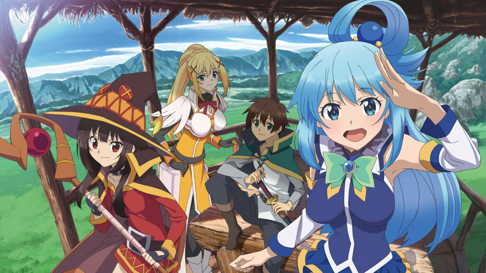

# app-dev

**My first repository**

*`Mark Joshua C. Sayen`*

# :sparkles:My favorite anime movie - *Kimi no Na wa.*

> ***Your Name** (Japanese: 君の名は。, Hepburn: Kimi no Na wa)* is a 2016 Japanese animated romantic fantasy film produced by [CoMix Wave Films](https://en.wikipedia.org/wiki/CoMix_Wave_Films). It depicts a high school boy in Tokyo and a high school girl in the Japanese countryside who suddenly and inexplicably begin to swap bodies. Things manage to become even more complicated when the boy and girl decide to meet in person. The film was commissioned in 2014, written and directed by [Makoto Shinkai](https://en.wikipedia.org/wiki/Makoto_Shinkai).

## **Top Cast**
| Voice Actors | Character Names|
| ----------- | ----------- |
|Ryûnosuke Kamiki   | Taki Tachibana |
|Mone Kamishiraishi  | Mitsuha Miyamizu |
|Ryô Narita | Katsuhiko Teshigawara|
|Aoi Yûki |Sayaka Natori |
|Nobunaga Shimazaki | Tsukasa Fujii|

## **Did You Know**

 

  
<b>Crazy credits</b>

  

               At the end of the film, as both the lead characters simultaneously says "Your name...", the title of the film appears.
  

  

  
<b>Trivia</b>

  

                  The red braided cord that Mitsuha wears represents the invisible red string of fate that is said to connect someone
       to their fated person, according to Japanese tradition.
  

  

  
<b>Soundtracks</b>

  

Yumetourou (Dream Lanturn)

Music and Lyrics by Youjirou Noda

Arranged and Performed by Radwimps
  

 

 
 
## **Other Movies by Makoto Shinkai**

* [Weathering with You (2019)](https://www.imdb.com/title/tt9426210/?ref_=fn_al_tt_1)
* [Suzume no Tojimari (2022)](https://www.imdb.com/title/tt16428256/?ref_=nv_sr_srsg_0)
* [The Garden of Words (2013)](https://www.imdb.com/title/tt2591814/?ref_=nv_sr_srsg_0)
* [5 Centimeters per Second (2007)](https://www.imdb.com/title/tt0983213/?ref_=fn_al_tt_1)

## **YouTube Trailer**

 <!--align="center"-->
  
  &#8287;&#8287;&#8287;&#8287;&#8287;

---

# :boom:My favorite anime series - *KONOSUBA: God's blessing on this wonderful world!*

> ***KonoSuba: God's Blessing on This Wonderful World!*** is a Japanese light novel series written by [Natsume Akatsuki](https://en.wikipedia.org/wiki/Natsume_Akatsuki). Konosuba is an anime that uses traditional anime archetypes to poke fun at specific genres. The story is simple, otaku boy dies and gets transported to another world where he finds himself surrounded by attractive females. The format of the show is similar to an RPG game where each character takes up roles like the healer, fighter and others. However, the setting is where these repetitive elements end. The anime takes on many twists and turns and has a high comedic quotient, making it stand out among others of the same genre.

## **Top Cast**
| Voice Actors | Characters|
| ----------- | ----------- |
|Takahashi, Rie   | Megumin |
|Fukushima, Jun  | Satou, Kazuma|
|Amamiya, Sora| Aqua|
|Kayano, Ai |Dustiness Ford, Lalatina|

## **Quick Review**
 

  
<b>About Konosuba</b>

  

           Konosuba is a light novel series written by Natsume Akatsuki and illustrated by Kurone Mishima. Currently, there are a total of 16 volumes of the light novel series, and 17th is to be believed to be the last one, 5 of them have been adapted in the form of anime.
  

  

  
<b>Characters</b>

  

          The characters are what make Konosuba really special. None of the characters is extremely powerful or overpowered. Even as a group, they have many limitations and are not the greatest. They have flaws that hold them back, and sometimes, arrogance gets the better of them. Despite the flaws, they eventually accept each other and drive the show towards a satisfying ending.
  

 
## **Watching Order**

1. Season 1: KonoSuba: God’s Blessing on This Wonderful World! (2016)
   * OVA 1: Kono Subarashii Sekai ni Shukufuku wo: Kono Subarashii Choker ni Shukufuku wo! (2016)
2. Season 2: KonoSuba: God’s Blessing on This Wonderful World! 2 (2017)
   * OVA 2: Konosuba: God’s Blessing On This Wonderful World! 2: God’s Blessing On This Wonderful Art! (2017)
3. KonoSuba -God’s Blessing On This Wonderful World! – Legend of Crimson (2019)

## **YouTube Trailer**

 <!--align="center"-->
  
  &#8287;&#8287;&#8287;&#8287;&#8287;

